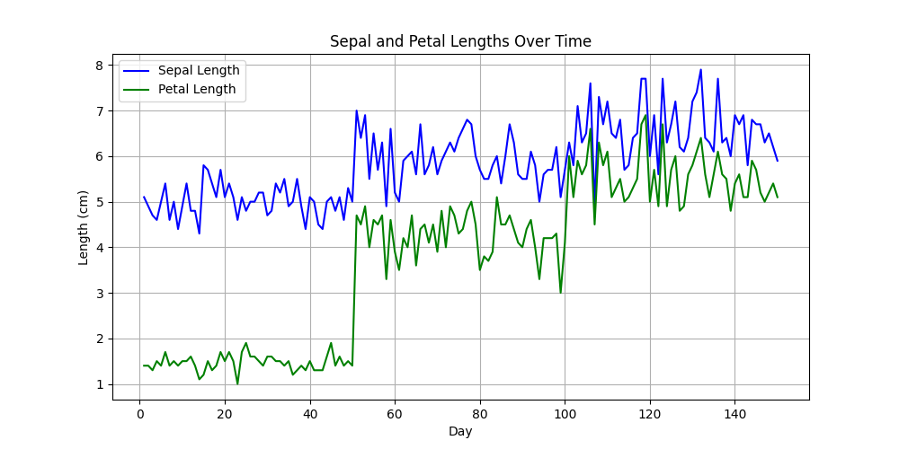
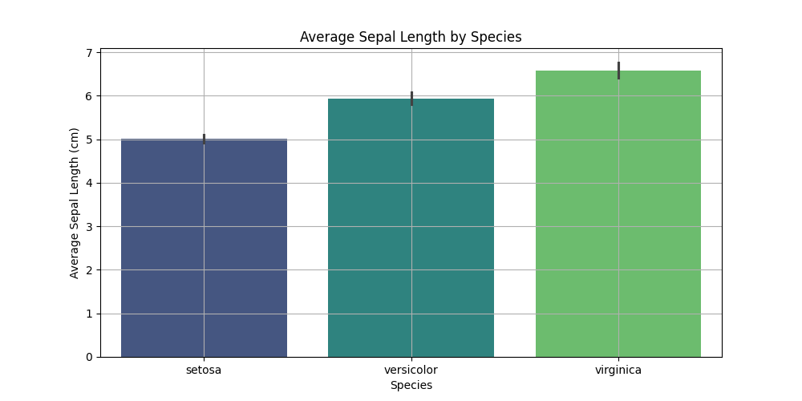
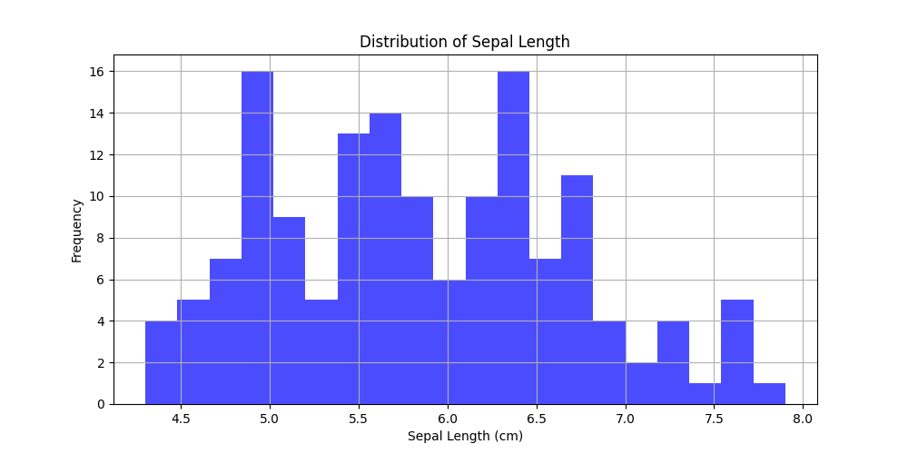
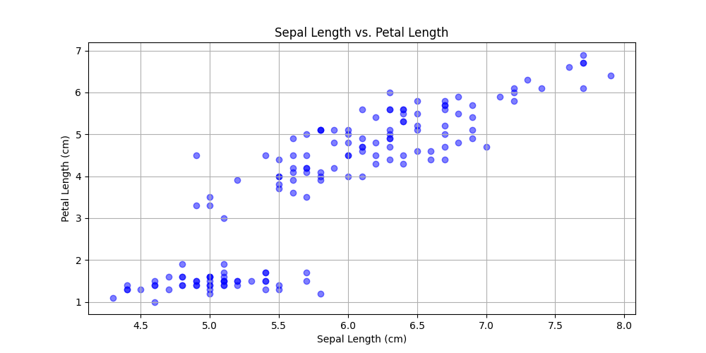

# Iris Dataset Analysis and Visualization

This project demonstrates how to analyze and visualize the Iris dataset using Python. The project is divided into two main scripts:

1. **`dataset.py`**: Performs data analysis and statistical operations on the Iris dataset.
2. **`data_visualization.py`**: Creates various visualizations to explore the dataset.

---

## Table of Contents
1. [Files in the Workspace](#files-in-the-workspace)
2. [Dataset](#dataset)
3. [`dataset.py`](#datasetpy)
4. [`data_visualization.py`](#data_visualizationpy)
5. [How to Run the Code](#how-to-run-the-code)
6. [Example Use Cases](#example-use-cases)
7. [References](#references)
8. [Author](#author)

---

## Files in the Workspace

- **`dataset.py`**: Contains code for loading the dataset, performing data cleaning, and generating statistical summaries.
- **`data_visualization.py`**: Contains code for visualizing the dataset using line charts, bar charts, histograms, and scatter plots.
- **`irisdata.txt`**: A text file containing the URL of the Iris dataset.
- **`README.md`**: This file, which provides an overview of the project.

---

## Dataset

The Iris dataset is a well-known dataset in machine learning and statistics. It contains 150 samples of iris flowers, with the following features:

- `sepal_length`: Length of the sepal in centimeters.
- `sepal_width`: Width of the sepal in centimeters.
- `petal_length`: Length of the petal in centimeters.
- `petal_width`: Width of the petal in centimeters.
- `species`: The species of the iris flower (`setosa`, `versicolor`, or `virginica`).

The dataset is loaded directly from the following URL:  
[https://raw.githubusercontent.com/mwaskom/seaborn-data/master/iris.csv](https://raw.githubusercontent.com/mwaskom/seaborn-data/master/iris.csv)

---

## `dataset.py`

This script performs the following operations:

1. **Load the Dataset**: Reads the Iris dataset from the URL.
2. **Data Inspection**:
   - Displays the first few rows of the dataset.
   - Prints the data types and checks for missing values.
3. **Data Cleaning**: Ensures there are no missing values in the dataset.
4. **Statistical Analysis**:
   - Generates basic statistics for numerical columns.
   - Groups the data by species and calculates the mean of numerical columns.
   - Compares the mean petal length and petal width for each species.

### Example Output:
- First few rows of the dataset.
- Summary statistics (mean, standard deviation, etc.).
- Mean petal length and width for each species.

---

## `data_visualization.py`

This script creates the following visualizations:

1. **Line Chart**: Simulates a time series of sepal and petal lengths over days.
2. **Bar Chart**: Displays the average sepal length for each species.
3. **Histogram**: Shows the distribution of sepal lengths.
4. **Scatter Plot**: Plots sepal length against petal length to explore their relationship.

### Libraries Used:
- `pandas`: For data manipulation and analysis.
- `matplotlib`: For creating static visualizations.
- `seaborn`: For creating aesthetically pleasing statistical plots.

### Example Visualizations:
- **Line Chart**: Simulates a time series of sepal and petal lengths over days.  
  
- **Bar Chart**: Displays the average sepal length for each species.  
  
- **Histogram**: Shows the distribution of sepal lengths.  
  
- **Scatter Plot**: Plots sepal length against petal length to explore their relationship.  
  

---

## How to Run the Code

1. Ensure you have Python installed on your system.
2. Install the required libraries using the following command:
   ```bash
   pip install pandas matplotlib seaborn

3. Run the scripts:
For data analysis:
   ```bash
   python dataset.py
   python data_visualization.py````
---

## Example Use Cases
- **Data Analysis**: Understand the statistical properties of the Iris dataset.
- **Visualization**: Explore relationships and distributions within the dataset.
- **Learning**: Practice data analysis and visualization techniques in Python.

---

## References
- [Iris Dataset on GitHub](https://github.com/mwaskom/seaborn-data)
- [Pandas Documentation](https://pandas.pydata.org/docs/)
- [Matplotlib Documentation](https://matplotlib.org/stable/contents.html)
- [Seaborn Documentation](https://seaborn.pydata.org/)

---

## Author
This project was created by Job Otieno as part of a Python assignment for Week 7.  
For more projects, visit Job Otieno's GitHub(https://github.com/Jakababa94)